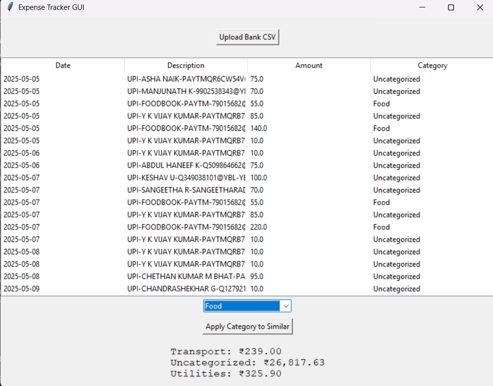

# 💸 Personal Expense Tracker (GUI-based)

A lightweight personal finance tracker built in Python using **Tkinter** and **Pandas**.  
It lets you upload raw **HDFC Bank CSV statements**, auto-categorizes transactions using smart pattern learning, and displays them in a clean GUI.

---

## ✅ Features

- 🧾 Upload raw bank CSV (no cleaning needed)
- 🧠 Auto-categorizes expenses using keyword matching
- 🖱️ Manually select transactions and apply categories
- 🔁 Learns your categorization patterns for future use
- 🧮 Displays categorized data in a GUI table

---

## 📦 Tech Stack

- Python 3
- Tkinter (GUI)
- Pandas (Data handling)

---

## 🛠️ Roadmap

- ✅ Upload and categorize CSVs
- ✅ GUI table with editable categories
- ⏳ Auto-refresh category totals on manual edit
- ⏳ Export categorized data to new CSV
- ⏳ Save/load learned categorization rules

---

## 🖼️ Screenshot




---

## 🚀 Getting Started

```bash
git clone https://github.com/clinton2720/expense_tracker.git
cd expense_tracker
pip install pandas
python tracker_gui.py
```


## 📬 Contact
Built by Clinton Vincent
Currently improving it every week. Feedback welcome.
